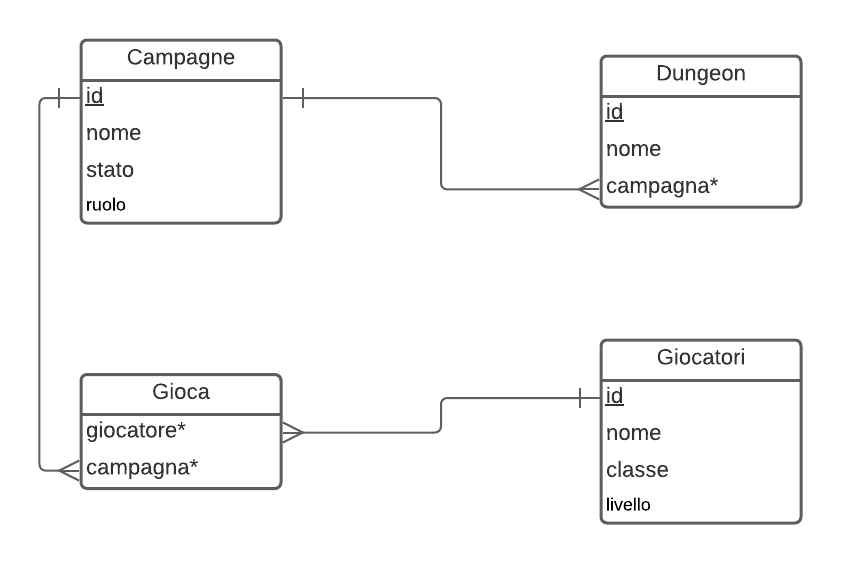

# DB&D

Simple database and web pages to handle my campaigns, pg and dungeons for world's most famous role-playing game!
<p align=center>
    
</p>

## Directories layout
```
├── docker-compose.yml
├── Dockerfile
├── dump            # sql files to phpmyadmin
│   └── myDb.sql
└── www             # pages and script 
    ├── images
    │   └── d&dlogo.jpg
    ├── index.html
    ├── pages       # html pages
    │   ├── Campagne.html
    │   └── testPage.html
    └── script      # php scripts
        └── myScript.php
```

## DB design
<p align=center>
    
</p>

Population DB example,

```sql
INSERT INTO `Giocatori` (`nome`, `classe`, `livello`) VALUES
('Haldebaran', 'Paladino', 13),
('Montemagno', 'Ramingo', 13),
('Fax', 'Vampiro', 13),
('Farkas', 'Vichingo', 13),
('Eiden', 'Angelo', 13),
('Conan', 'Barbaro', 10);
```
